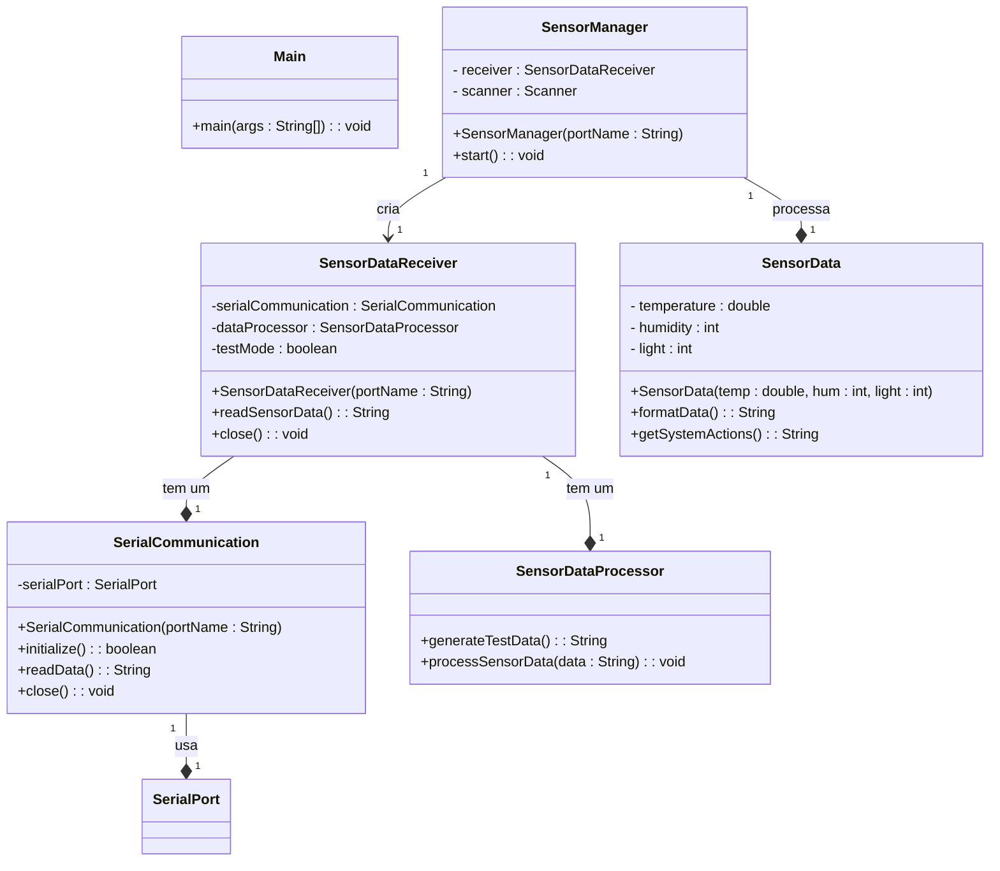

# 📡 Sensor Data Receiver

Este projeto é um sistema de monitoramento de sensores que se comunica com uma porta serial para obter leituras de **temperatura, umidade e luminosidade**. Ele exibe as leituras de forma organizada no terminal, fornece alertas quando os valores estão fora dos padrões e simula leituras no **modo de teste**.

---

## ✨ Funcionalidades

✅ Leitura de dados de sensores por meio de uma porta serial.  
✅ Processamento de dados e exibição estruturada no terminal.  
✅ Alertas para temperatura alta, umidade baixa e luz intensa.  
✅ Registro de histórico de leituras em `sensor_log.txt`.  
✅ **Modo de Teste** para simular dados sem hardware físico.  
✅ Interface interativa no terminal, permitindo múltiplas leituras.

---

## 🛠 Estrutura do Projeto

📂 `` → Ponto de entrada da aplicação.  
📂 `` → Gerencia a leitura de sensores e interação com o usuário.  
📂 `` → Responsável por coletar dados do sensor.  
📂 `` → Modela os dados do sensor e gera alertas com base nos valores.  
📂 `` → Realiza a comunicação serial com os sensores físicos.  
📂 `` → Processa os dados e gera leituras no modo de teste.  
📂 `` → Registro histórico das leituras dos sensores.

---

## 🔧 Pré-requisitos

📌 **Java Development Kit (JDK)** instalado.  
📌 Biblioteca **jSerialComm** adicionada ao projeto.  
📌 IDE da sua preferência (**IntelliJ**, **Eclipse**, **VS Code** etc.).

---

## 🚀 Como Usar

1️⃣ Clone este repositório:

```sh
git clone https://github.com/seu-repositorio.git
```

2️⃣ Abra o projeto na sua **IDE Java** preferida.  
3️⃣ **Adicione a biblioteca jSerialComm** ao projeto.  
4️⃣ Para usar o **modo de teste**, defina `testMode = true` em `SensorDataReceiver.java`.  
5️⃣ Execute a classe `Main` para iniciar o monitoramento.

---

## 🎭 Modo de Teste

O **modo de teste** gera dados simulados para testar o sistema sem necessidade de hardware físico. Para ativá-lo, modifique a variável `testMode`:

```java
private boolean testMode = true; // true para simulação, false para hardware físico
```

---

## 📊 UML - Diagrama de Classes



---

## 📱 Protótipo Ilustrativo

Este projeto conta com um **protótipo mobile** no Figma para representar uma interface gráfica idealizada para um ambiente smart home. **Este protótipo é apenas ilustrativo e não faz parte da implementação no terminal.**

🎨 [**Acesse o protótipo no Figma**](https://www.figma.com/design/FcUjUmA3Yr3K1A1IGixOBM/Smart-Home---prototipo-PI?node-id=0-1\&t=EacrxY74hyioRjRt-1)

### 📸 Screenshot do Protótipo

Abaixo está uma prévia do protótipo desenvolvido no Figma:


---

## 📌 Observações

🔹 Se estiver rodando com sensores reais, certifique-se de definir `testMode = false`.  
🔹 O sistema exibe **alertas visuais** no terminal para valores fora dos padrões.  
🔹 O histórico das leituras é salvo automaticamente em `sensor_log.txt`.

💡 **Sugestões de melhoria são sempre bem-vindas!** 🚀

